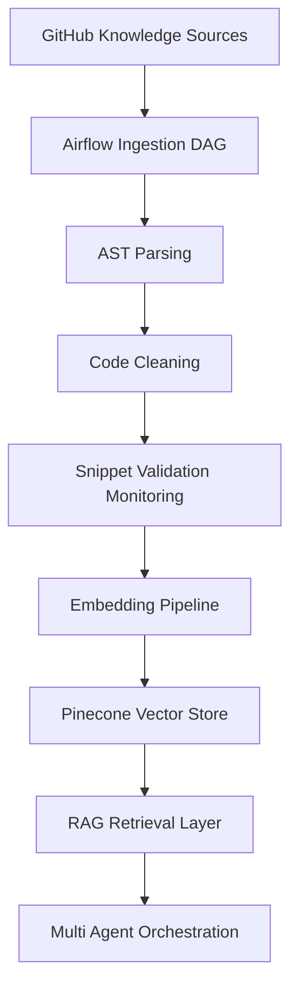
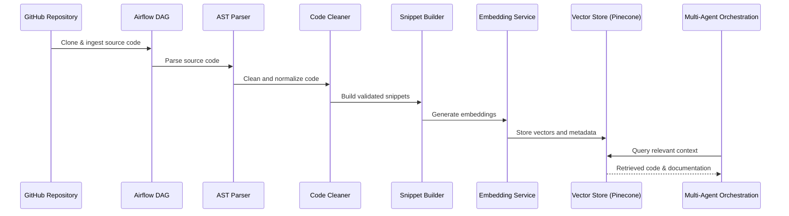

# multiagent-codegen-ai-platform
# Multi-Agent CodeGen AI Platform

> **Course**: DAMG 7245 – Big Data Systems & Intelligent Analytics  
---

## 1. Project Overview

The **Multi-Agent CodeGen AI Platform** is an end-to-end data engineering and AI system designed to ingest large-scale open-source code repositories, process them through structured parsing and validation, generate embeddings, and enable **Retrieval-Augmented Generation (RAG)** for intelligent code search and reuse.

This project builds a production-scale, multi-agent code generation platform that processes code and documentation from 6 diverse sources, uses specialized AI agents for different aspects of code generation, and deploys on cloud-native infrastructure with comprehensive quality guardrails.

Data Sources (6 sources):
●	GitHub repositories
●	Stack Overflow Q&A
●	Official documentation
●	GitHub Issues/PRs
●	Code examples (Kaggle/Colab)
●	Technical blogs (Dev.to/Medium)


LLM Components:
●	5 specialized AI agents (Requirements Analyzer, Programmer, Test Designer, Test Executor, Documentation Generator)
●	CrewAI-based multi-agent orchestration
●	RAG implementation with Pinecone vector database
●	2M+ code snippet embeddings using OpenAI text-embedding-ada-002
●	Iterative code refinement based on test feedback


Project demonstrates real-world practices in:
- Data ingestion and orchestration using **Apache Airflow**
- **AST-based code parsing** and complexity analysis
- Data quality validation and monitoring
- Cost-aware embedding pipelines
- Vector-based semantic retrieval for AI-assisted code generation

---

## 2. System Architecture


This diagram illustrates the core data and retrieval pipeline; multi-agent orchestration consumes shared context from the RAG layer to support coordinated code generation workflows.


Architecture Design Highlights

1. Modular pipeline design with clear separation of responsibilities

2. Containerized execution for reproducibility and scalability

3. Explicit observability through validation and monitoring metrics


## 3. Data Flow Diagram



```md
## 4. Repository Structure

```
.
├── dags/                     # Airflow DAG definitions
│   └── ai_codegen_ingest_dag.py
├── src/                      # Core pipeline modules
│   ├── agents/               # Multi-agent logic
│   ├── backend/              # Backend services
│   ├── embeddings/           # Embedding pipeline
│   ├── etl/                  # ETL & ingestion
│   ├── frontend/             # UI / demo interface
│   ├── parser/               # AST parsing
│   ├── processing/           # Data processing logic
│   ├── rag/                  # RAG retrieval
│   └── tools/                # Shared utilities
├── data/
│   ├── raw/                  # Downloaded repositories
│   ├── processed/            # Parsed & cleaned outputs
│   └── rag_outputs/          # RAG query outputs
├── tests/
├── scripts/
├── Dockerfile
├── docker-compose.yml
├── .env.example
└── README.md

```

## 5. Setup Instructions
Prerequisites

Docker

Docker Compose

Git

Environment Variables

Create a .env file based on .env.example:

OPENAI_API_KEY=your_openai_key
PINECONE_API_KEY=your_pinecone_key
PINECONE_ENV=your_pinecone_environment

## 6. How to Run the Project
Step 1: Start the Services
docker compose up -d

Step 2: Access Airflow UI

Open your browser and go to:

http://localhost:8081

Step 3: Trigger the Pipeline

Locate the DAG: ai_codegen_ingest_dag

Trigger the DAG manually from the Airflow UI

Step 4: Verify Outputs

Processed snippets: data/processed/

Final snippet corpus: data/processed/final_snippets/

RAG outputs: data/rag_outputs/

## 7. Data Quality Validation & Monitoring

To ensure reliable downstream retrieval, the pipeline includes explicit validation and monitoring mechanisms.

1.Validation Rules
2.Required fields present (e.g., snippet_id, code, language)
3.Non-empty code blocks
4.Valid function and class metadata
5.Acceptable complexity ranges
6.Monitoring Metrics
7.Total snippets processed
8.Valid snippets
9.Dropped snippets
10.Drop rate percentage

These metrics provide transparency into pipeline health and data quality.

## 8. Embedding & Vector Storage

Embedding Model: OpenAI 1536-dimension embedding model (cost-efficient)

Vector Store: Pinecone

Design Choice

Store semantic vectors and metadata only

Retrieve full code via snippet IDs and file paths

This approach balances cost, scalability, and retrieval accuracy.

## 9. Retrieval-Augmented Generation (RAG)

The RAG module enables:

1.Natural-language code search
2.Semantic retrieval of relevant code snippets
3.Structured context generation for downstream LLM usage

This supports intelligent code reuse and AI-assisted development workflows.

## 10. Team Contributions
Member	Responsibilities
Pei-Ying Chen: ETL pipeline, Airflow DAGs, AST parsing, data validation & monitoring, embedding pipeline, RAG integration

Hemanth Rayudu: Multi-agent logic, retrieval strategies, LLM integration

Om Shailesh Raut: Supporting modules per proposal scope
## 11. Future Improvements

1.Incremental ingestion and re-embedding

2.Advanced AST-based metrics

3.Multi-language code support

4.Human-in-the-loop validation workflows
